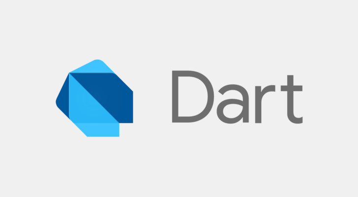

# PatanCollegeApplication
> This application was my first mobile application made using flutter sdk and making this project was a great experince for me as it took me quite a long time and daily I added some features to make it interactive and attractive.

# Introduction
Patan Campus app is an app that acts as a bridge between student and college. Actually we are launching app on dual platform one for android and one for desktop. These both app helps student to register their id, and query any problem to administrator through an app, can get instant realtime notice from the college with push notifications which will be binded by database  at backend and has many built in features like news portal, calendar, staff details and so on.

# Objectives

* To send any new notices and information about college activities on real time with push notifications feature so that student can get message at instant that is even student is not opening their phone they can get notification ring and view that notice just with one click on that notification.

* Student can put their problems and any queries they like to convey to an administrator  through  this app.

* To view all the contacts of staffs and now we don’t have to search each individual staff ‘s numbers on phone in fact all the teachers information will be embedded inside an app(on android) and we can call directly from here with just one click

* Built in geolocation feature where new student using this app can easily track and able to find college from anywhere.

* Other features embedded like real time calenders, resources, and so on.

# Scope and Limitations
Since we are just a beginner and learning to explore the idea on our project, everything we do won’t be perfect. I would like to mention some of the limitation of our projects:
*	Main difference is that android app and desktop app won’t resemble much though we try our best.
*	There is no any push notifications features on desktop.
*	Only available for android and desktop not for IOS.
*	Calling facility not available for desktop only for android
*	Internet connection is must for both app, if there is no internet they won’t work.

# Snapshots Of Application

# Techologies used

* Flutter

* Dart

* Firebase

* Vscode

## ©️ Santosh Thapa 2020

